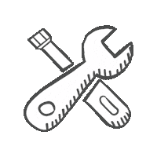
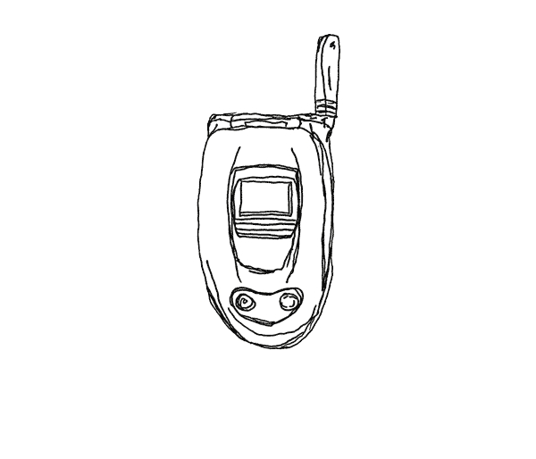

<!--Title-->
## Hello | Salut | こんにちは | Hola 

<!--Introduction-->
<!-- Icons -->
I'm Steeve, and I am a graduate research student at Chuo Univerty (Tokyo, JP). I’m always eager to connect with others who are building thoughtfully.</b>

- 😄 Pronouns: **he/him/his**
- 🔭 I’m currently working on **independent graduate research**
- 🌱 I’m currently learning **statistical methods for data analysis**
- 💬 Ask me about **life is in Japan**
- 📫 How to reach me: **steevensangou@gmail.com**
- ⚡ Fun fact: I can read the English, French, Japanese, Spanish, and Korean alphabets (but don't ask me what the sentence means)!

<i>*All work shared here reflect my own opinions and does not reflect any of my affiliated institutions.</i>

## GitHub Usage Statistics 
<!--User Statistics-->

## Technologies & Tools 
<!--User Skills-->

<!---->

<!---->

## Contact 

